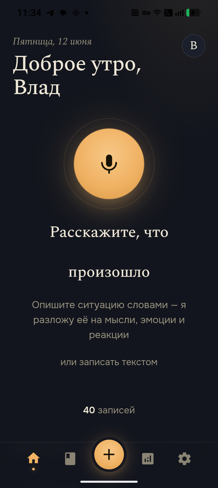
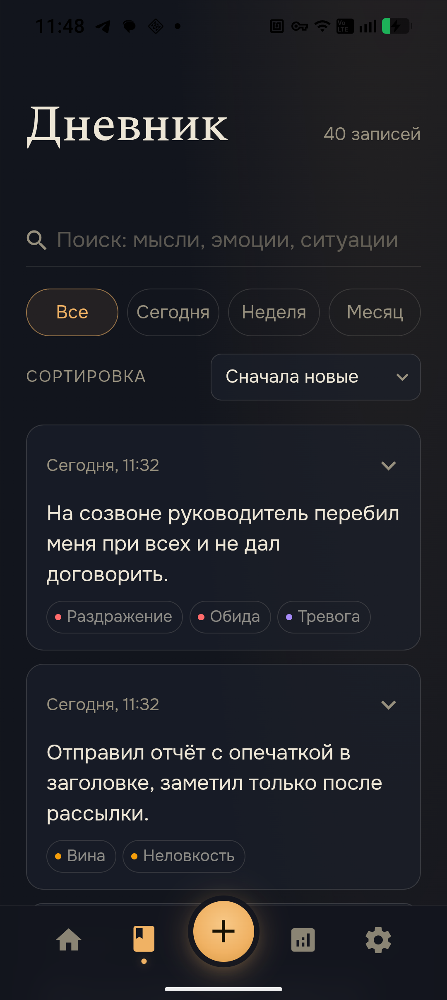
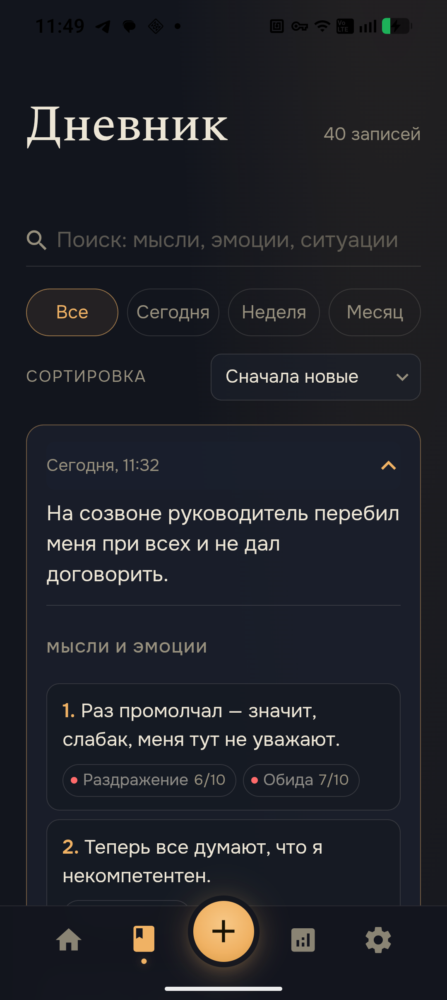
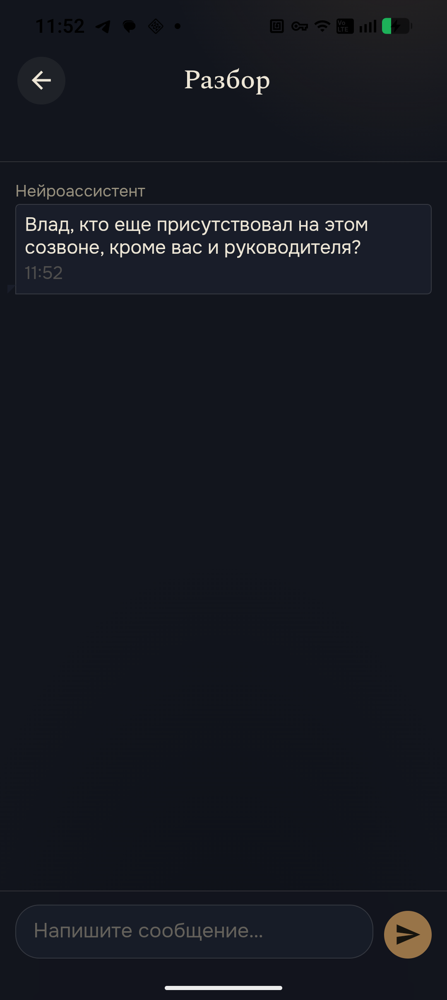
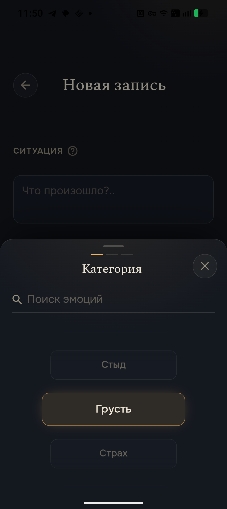
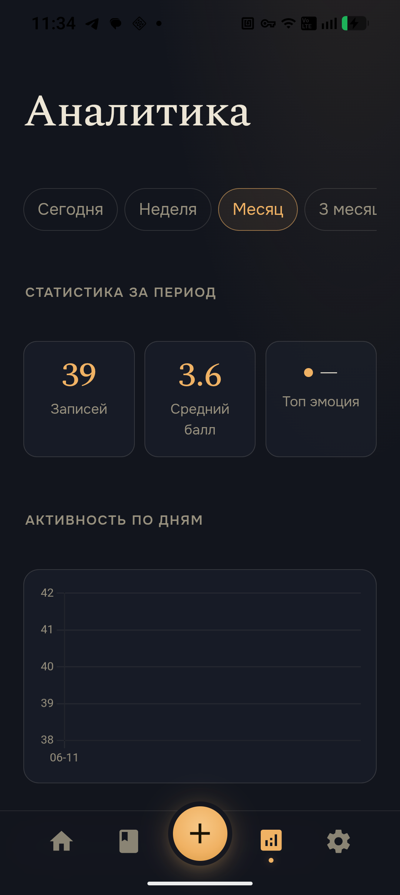
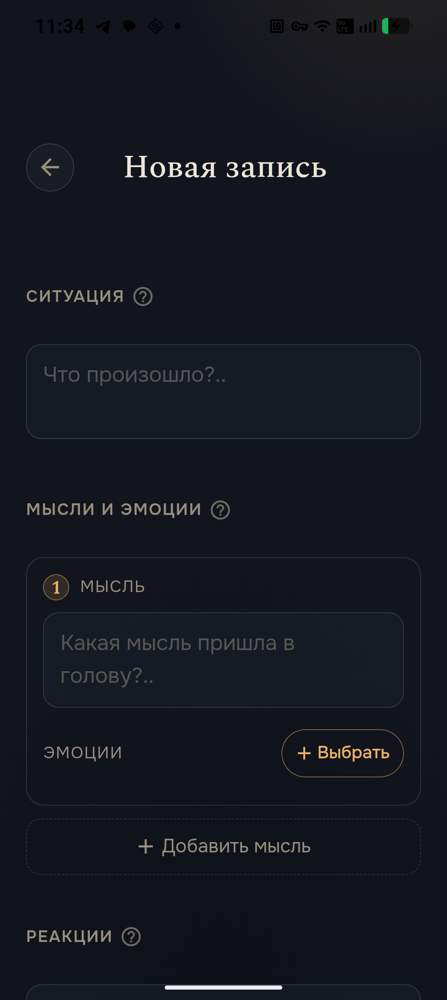
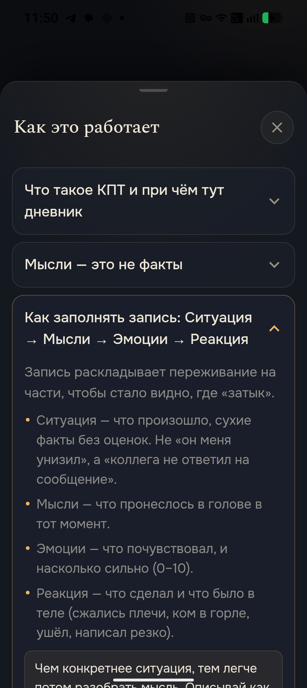
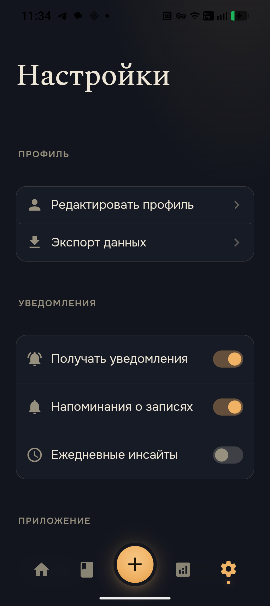

<div align="center">

# 🌙 CBD — Cognitive Behavioral Diary

**A voice-first mood journal built on Cognitive Behavioral Therapy.**
Capture a moment out loud, untangle it into *situation → thoughts → emotions → reaction*,
and talk it through with an AI guide. Offline-first, Android (Tauri Mobile) + desktop.

[](https://github.com/fkupme/cbd-diary/stargazers)
[](https://github.com/fkupme/cbd-diary/issues)
[](https://github.com/fkupme/cbd-diary/actions)
[](./LICENSE)


</div>

---

## ✨ Highlights

- **🎙️ Voice-first capture** — tell the app what happened; it helps break the moment down instead of staring at an empty form.
- **🧩 СМЭР / CBT model** — every entry is structured as **Situation → Thoughts → Emotions → Reaction**, with multi-link *thought chains* (one situation can spawn several thoughts, each with its own emotions).
- **🎡 121-emotion wheel** — a draggable 3D picker across 5 categories (anger, shame, sadness, fear, joy), each emotion rated 0–10.
- **🤖 AI guided reflection** — a staged CBT chat (powered by Google Gemini) that walks an entry through *collect context → find the core belief → gently dispute it → consolidate*, with built-in safety handling.
- **📊 Analytics** — activity over time, emotion-category diversity (Shannon / Simpson / evenness), top emotions and lightweight insights.
- **📚 Built-in psychoeducation** — a tap-away “How it works” explains CBT ideas (thoughts ≠ facts, cognitive distortions, how to dispute a harsh thought) in plain language.
- **🔒 Private & offline-first** — entries live in a local SQLite DB on device and sync to the server; biometric lock; no third-party trackers.
- **🌒 “Evening diary” design** — ink-and-lamp dark theme (Spectral + Onest), intentionally unlike the usual minty mental-health template.

## 📸 Screenshots

> Russian-language UI shown with seeded demo data.

|  |  |  |
| :---: | :---: | :---: |
|  |  |  |
| **Voice-first home** | **Diary** | **Entry — СМЭР chains** |
|  |  |  |
| **AI guided reflection** | **121-emotion wheel** | **Analytics** |
|  |  |  |
| **Manual entry** | **CBT psychoeducation** | **Settings** |

## 🧠 How it works — the СМЭР model

CBT’s core idea: it isn’t the event that shapes how we feel, but how we *read* it. Between a situation and an emotion there’s always a thought — often too fast to notice. An entry makes that visible:

- **Situation** — the bare facts, no judgement (*“a colleague didn’t reply”*, not *“they ignored me”*).
- **Thoughts** — what actually ran through your head. A second thought often reacts to the first → a **chain**, each link with its own emotions.
- **Emotions** — what you felt, and how strongly (0–10).
- **Reaction** — what you did and what your body did.

The AI chat then helps test the heaviest thought against the evidence — not “think positive”, but “think honest”.

## 🏗️ Tech stack

| Layer | Stack |
| --- | --- |
| **Mobile / desktop app** | [Tauri 2](https://tauri.app) · Vue 3 + TypeScript · [Quasar 2](https://quasar.dev) · Pinia · Chart.js |
| **On-device storage** | Rust + [`sqlx`](https://github.com/launchbadge/sqlx) over SQLite (WAL), offline-first with server sync |
| **Backend API** | [NestJS 11](https://nestjs.com) (TypeScript) · Prisma · WebSocket (Socket.IO) |
| **Data** | PostgreSQL · Redis |
| **AI** | Google **Gemini 2.5 Flash** (streaming chat + structured stage transitions) |
| **Infra** | Docker Compose · Traefik · GitHub Actions CI/CD |

## 📁 Repository layout

```
cbd-diary/
├── cbd.mobile-app/      # Tauri 2 + Vue 3 client (UI, local SQLite via Rust)
│   └── src-tauri/       # Rust core: local DB, emotion-catalog sync, secure storage
├── cbd.web-api/         # NestJS API: auth, CBT entries, emotions, analytics, AI chat
├── docker-compose.yml   # postgres · redis · api-dev · api-prod (Traefik)
└── .github/workflows/   # CI (build) + deploy (SSH → compose on VPS)
```

## 🚀 Quick start

**Prerequisites:** Node 18+, Docker, Rust toolchain, and (for Android) Android SDK + NDK.

```bash
# 1. Backend + database (Docker)
POSTGRES_HOST_PORT=5433 docker compose --env-file .env.development up -d postgres redis api-dev
# API → http://localhost:3002/api/v1   (health: /sync/health)

# 2. Mobile app — web preview
cd cbd.mobile-app
npm install
npm run dev                 # http://localhost:1420

# 3. Mobile app — on a device / emulator
npm run android:dev         # Tauri Android dev build
```

Demo login is available on the sign-in screen. To build a standalone APK:

```bash
cd cbd.mobile-app
npm run android:build:apk -- --debug --target aarch64
```

> By default a packaged build talks to the production API. Point it elsewhere with
> `VITE_API_BASE_URL=http://<host>:3002/api/v1` at build time.

## 🤖 The AI chat, in short

The assistant isn’t a free-form chatbot — it runs a small **state machine** per entry:

`collect_context → find_belief → dispute → consolidate`

A lightweight transition checker advances the stage based on what the user actually says, each stage has its own focused prompt, and a safety rule always takes precedence (if a user signals crisis, the bot stops the technique, validates feelings, and points to real human help / emergency services). A separate finalizer summarizes the session and the belief worked on.

## 🗺️ Roadmap

- [ ] Real speech-to-text + automatic СМЭР extraction on the voice-capture screen
- [ ] Achievements / streak-based motivation
- [ ] Richer progress reports & best-technique suggestions
- [ ] iOS build
- [ ] More localized emotion catalogs

## 🤝 Contributing

Issues and PRs are welcome. It’s a TypeScript monorepo (app + API) with a Rust core for the on-device database — see [`cbd.mobile-app`](./cbd.mobile-app) and [`cbd.web-api`](./cbd.web-api).

## 📝 License

[MIT](./LICENSE) © fkupme

## ⭐ Star history

<a href="https://star-history.com/#fkupme/cbd-diary&Date">
  
</a>

---

<div align="center">

🇷🇺 **Кратко по-русски:** голосовой дневник настроения на основе КПТ. Описываешь ситуацию — приложение помогает разложить её на *Ситуацию · Мысли · Эмоции · Реакцию* (СМЭР), оценить эмоции по колесу из 121 эмоции и разобрать тяжёлую мысль в чате с ИИ-ассистентом. Кроссплатформенно (Tauri 2 + Vue 3), офлайн-first, бэкенд на NestJS + Gemini.

⭐ **Нравится идея? Поставь звезду — это правда помогает.**

</div>
